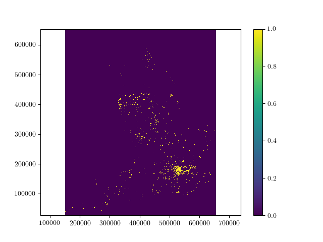

# Flood Risk Prediction tool

## Deadlines
-  *code 12pm GMT Friday 25th November 2022*
-  *presentation/ one page report 4pm GMT Friday 25th November 2022*

### Key Requirements

Your project must provide the following:

 - at least one analysis method to estimate a number of properties for unlabelled postcodes extrapolated from sample data which is provided to you:
    - Flood risk (on a 10 point scale).
    - Median house price.
 - at least one analysis method to estimate the Local Authority & flood risk of arbitrary locations. 
 - a method to find the rainfall and water level near a given postcode from provided rainfall, river and tide level data, or by looking online.

 You should also provide visualization and analysis tools for the postcode, rainfall, river & tide data provided to you, ideally in a way which will identify potential areas at immediate risk of flooding.
 
 Your code should have installation instructions and basic documentation, either as docstrings for functions & class methods, a full manual or both.





This README file *should be updated* over the course of your group's work to represent the scope and abilities of your project.

### Assessment

 - your code will be assessed for its speed (both at training and prediction) & accuracy.
 - Your code should include tests of its functionality.
 - Additional marks will be awarded for high code quality and a clean, well organised repository.

 ### Installation Guide

To install, run the command below in a terminal:
``python setup.py install``

The package contained in the requirements.txt file should be pip installed by running the following command:
``pip install -r requirements.txt``

The environment can be installed through the following command:
``conda env create -f environment.yml``

### User instructions

#### Modelling Instructions

The task of modelling involved predicting respective variables ranging from flood probability, median price and local authority. Flood probability had features pertaining to latitude, longitude, soil type and altitude; median price used latitude, longitude, soil type, altitude and local authority; and local authority capitalised on only easting and northing. Several options were considered for the model, however the best ones were Random Forest Regressor for flood probability, and KNeighborsRegressor for median price and local authority. It is worth noting that an additional model was made to predict the flood probability but alternatively only using the latitude and longitude which makes use of Random Forest Regressor. This fourth model is an alternative to the first model and it also gives a similar score.

There were several python files created for the workflow of the four models which are: 
floodclass_from_loc_model.py
floodclassmodel.py 
localauthoritymodel.py
median_price_model.py

However, kindly note that the tool.py pertains to the final training of the dataset and is somewhat a compilation of the four python files mentioned above. There is a notebook / interface called ```toolUserInterface.ipynb``` which contains examples of how to run the tool file to generate predictions 

#### Visualisation Instructions 

For the visualisation, the main module is ```visualisation.py```. Users can import this module with the class Visualisation. When the Visualisation is initialised (eg. ```vis=Visualisation()```), it automatically reads the some preexisted rainfall, river stage and tidal data files from the folder ```flood_tool/resources```. Users can also change the file path to what they want to show different data.

If users want to plot the risk of flood trained by models, they need to call the function ```plotfile(datapath)``` in this class, the data can be any data with the same structure as the training datasets(```flood_tool/resources/postcodes_sampled_data.csv```).

After calling the plotfile function (eg. ```vis.plotfile()```), call the map attribute of the object (eg. ```vis.map```)the map will show with the default layer risk of flood on. Map can be dragged and zoomed. In order to see more layers like rainfall or river data. Just click the layer icon on the right corner, and select or deselect the layer to display on or off.

For the individual point information on the map, just move mouse over any maker or icon, more information like values or position will show up.

For the display of the live data, first, user need to use function ```get_all_live_data()``` in ```live.py``` file, which will update the data file "flood_tool/resources/latest_live_data.csv". Updating process will take about 30 minutes, so user can just plot the data in this file directly without updating the data for testing. ```plotfile()``` function will automatically plot the live data based on the ```latest_live_data.csv```.

### Description of new modelling files
- ```local_authority.ipynb``` : shows method to find optimal model for predicting local authority
- ```localauthoritymodel.py``` : python class containing the optimal local authority model to be used for predicting in tool.py

- ```floorrisk_model_worksheet.ipynb```
- ```flood_risk_model_final_02.ipynb ```
   - the above two files show methods to find the optimal model for predicting flood class
- ```floodclassmodel.py``` : class representing the best model found for predicting flood class, to be used in tool.py

- ```medianprice_model.ipynb``` : shows methods to find the best median price model
- ```median_price_model.py``` : contains the final best model for predicting median price, used in tool.py
- ```find_median_price_model.py``` : contains a class to find and train the best median price model


### Documentation

Kindly refer to the index.html for the function descriptions. 

The code includes [Sphinx](https://www.sphinx-doc.org) documentation. On systems with Sphinx installed, this can be build by running

```
python -m sphinx docs html
```

then viewing the generated `index.html` file in the `html` directory in your browser.

For systems with [LaTeX](https://www.latex-project.org/get/) installed, a manual pdf can be generated by running

```bash
python -m sphinx  -b latex docs latex
```

Then following the instructions to process the `FloodTool.tex` file in the `latex` directory in your browser.

### Testing

The tool includes several tests, which you can use to check its operation on your system. With [pytest](https://doc.pytest.org/en/latest) installed, these can be run with

```bash
python -m pytest --doctest-modules flood_tool
```

- ```main_tests.py``` : contains tests for general data processing functions
- ```test_scorable.py``` : contains general tests for the tool file, which handles training models and making predictions

run using ```python main_tests.py``` or ```python test_scorable.py```

Additional added tests should be run the same way in the ads-deluge-Severn folder


### Reading list

 - (A guide to coordinate systems in Great Britain)[https://webarchive.nationalarchives.gov.uk/20081023180830/http://www.ordnancesurvey.co.uk/oswebsite/gps/information/coordinatesystemsinfo/guidecontents/index.html]

 - (Information on postcode validity)[https://assets.publishing.service.gov.uk/government/uploads/system/uploads/attachment_data/file/283357/ILRSpecification2013_14Appendix_C_Dec2012_v1.pdf]
